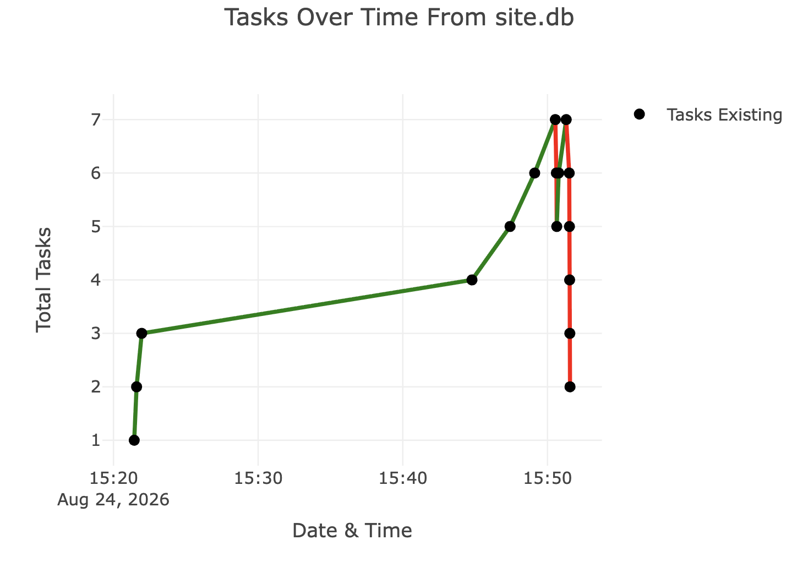

# Flask & Plotly Project

## Flask Task Master

A simple Flask to-do app using HTML templates, SQLite, SQLAlchemy, and a Plotly dashboard.

## Page Workflow

```text
app.py
|
|-- GET /
|   |
|   |-- runs index()
|   |-- reads Todo rows from site.db
|   |-- reads TaskEvent rows for the Plotly graph
|   |
|   v
|   templates/index.html
|   |
|   |-- inherits shared structure from templates/base.html
|   |-- displays the task table
|   |-- displays the add-task form
|   |-- displays the Plotly dashboard
|   |
|   |-- POST / from add-task form
|   |   |
|   |   |-- saves a new Todo row
|   |   |-- records a +1 TaskEvent
|   |   v
|   |   redirects back to GET /
|   |
|   |-- GET /update/<id> from Update link
|   |   |
|   |   v
|   |   templates/update.html
|   |   |
|   |   |-- inherits shared structure from templates/base.html
|   |   |-- displays a form for editing one task
|   |   |
|   |   |-- POST /update/<id>
|   |   |   |
|   |   |   |-- updates the Todo row
|   |   |   v
|   |   |   redirects back to GET /
|   |
|   |-- GET /delete/<id> from Delete link
|       |
|       |-- deletes the Todo row
|       |-- records a -1 TaskEvent
|       v
|       redirects back to GET /
|
v
templates/base.html
|
|-- provides the shared HTML skeleton
|-- provides  and 
```

## Plotly Dashboard

The Plotly line graph shows the total number of tasks over time using `TaskEvent` rows from `site.db`.

Green line segments mean tasks were added. Red line segments mean tasks were deleted.


